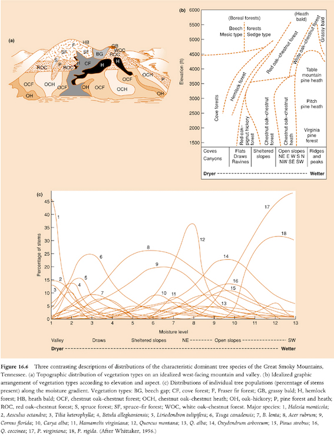

***
Universidade Federal da Grande Dourados  
Faculdade de Ciências Biológicas e Ambientais  
Laboratório de Ecologia Teórica  

***


```{r setup, include=FALSE}
library(learnr)
knitr::opts_chunk$set(echo = FALSE)
source("generico.R")

```    
    
  
# 1. Padrões em comunidades    

***  
    
## Apresentação    
Este é o roteiro do curso de introdução às análise multivariadas oferecido como a disciplina Análises Multivariadas em Entomologia do Programa de Pós-Graduação em Entomologia e Conservação da Biodiversidade. Nesse curso vamos abordar os principais métodos para ordenção de amostras a partir das diferenças em composição de espécies nas comunidades ecológicas usando o programa R (R Core Team 2021).      
  
## 1.1. O que é uma comunidade ecológica?    
    
O conjunto de populações que coexistem no espaço e no tempo é a definição óbvia de uma comunidade biológica. Entretanto, está longe de ser algo útil para se definir seus limites (ou mesmo se eles existem!), pois a escala espaço-temporal é determinante para isso. A definição de comunidade é discutida há bastante tempo (desde antes das visões de super-organismo de Clements e individualística de Gleason). Pouco tempo atrás, Ricklefs escreveu um ensaio que provocou uma discussão interessante sobre o tema (veja Ricklefs 2008, Brooker *et al.* 2009, Ricklefs 2009). O básico é que a partir do conjunto total de organismos (de todas as espécies é claro), aqueles que irão compor uma comunidade serão limitados por sua capacidade de chegar até o local, seus requerimentos de habitat (condições abióticas) e suas interações biológicas com outros organismos (veja Figura 16.1 no livro de Begon *et al.* 2006).    
    
    
    
    
Quem estuda comunidades está acostumado com o termo "assemblage". O uso desse termo ou de "community" tem sutis diferenças, que geralmente indicam distintos pontos de vista ecológico. Via de regra, autores que usam "assemblage"  estão interessados no conjunto de populações independentemente das suas interações ou associações evolutivas. De qualquer forma, considerando-se qualquer abordagem, uma comunidade ecológica é uma estrutura multidimensional em que cada dimensão corresponde a um de seus componentes. Muitas vezes, como é o caso nesse curso, consideramos as espécies como os componentes da comunidade. Entretando, outros níveis taxonômicos (gêneros ou famílias, por exemplo), grupos funcionais ou, até mesmo, indivíduos são componentes válidos.    
Essa multidimensionalidade implica no problema de como representar uma comunidade de forma a recuperar os padrões que emergem dos seus processos estruturadores, uma vez que a mente humana só consegue perceber poucas dimensões (veja, por exemplo, a Figura 16.6 em Begon *et al.* 2006). Esses padrões emergentes estão associados a diferentes hipóteses para a variação em composição da comunidade ao longo de gradientes ecológicos. Sendo que para definir esses padrões, podemos considerar três aspectos básicos nas matrizes de ocorrência das espécies em diferentes locais (Leibold & Mikkelson 2002): Coerência, substituição ("turnover") de espécies e agrupamento de distribuições ("boundary clumping").     

    
   

Independentemente da explicação, o principal padrão na estrutura de uma comunidade pode ser representado com a simples associação de gráficos da distribuição das espécies ao longo desses gradientes como vemos em Whittaker (1956). Em seu curso sobre análises multivariadas, Flávia Costa e William Magnusson (INPA) mostram como fazer isso usando uma estrutura genérica desses gráficos. Para isso podemos usar a função escrita por Victor Lemes Landeiro (UFMT), que está disponível como o script "generico.R" no [site do PPBio](https://ppbio.inpa.gov.br/disciplinas/multivariada). Vamos ver essa função atuando com dados simulados da distribuição de oito espécies de formigas em um gradiente altitudinal. Você pode obter esses arquivos na pasta 'data' acessível em https://drive.google.com/drive/folders/193KdrGxaz3e7mykGbUV3EYQwE89YnQgM?usp=sharing            
    
```{r generico, echo = TRUE}
formigas <- read.csv("formigas.csv")[, -1]
altitude <- read.csv("altitude.csv")[, -1]
generico(tabela = formigas, gradiente = altitude, at = 15, grad = "Altitude (m)", eixoY = "Abundância relativa", eixoX = "Locais ordenados pela altitude")
```     
     

## 1.2. Análise direta de gradientes    
    
Conforme aumenta a altitude, as espécies de formigas são substituídas por outras, revelando um padrão relacionado a esse gradiente ("species turnover"). Algumas espécies ocorreram em apenas um local: spp4, spp7 e spp8. Sendo que spp4 ocorreu no local de menor altitude (120 m), spp7 naquele de maior altitude (930 m) e spp8 em um dos locais de altitude intermediária (440 m).  Considerando-se somentes as espécies com frequência de ocorrência > 1, spp2 e spp6 dominaram em pequenas altitudes, sendo substituídas por spp3, que por sua vez foi substituída por spp5 e spp1 que dominaram nas maiores altitudes. Esse então é o padrão na estrutura da comunidade de formigas associado a (guiado pela) altitude. Perceba que esse não é necessariamente o principal padrão na estrutura da comunidade de formigas, nem ao menos um padrão importante! O que fizemos foi ordenar os locais da menor para a maior altitude e organizamos a posição das espécies no gráfico múltiplo de forma a perceber esse padrão (consideramos a média ponderada da abundância das espécies pela altitude).    
    
Preste atenção na distribuição de cada espécies ao longo do gradiente de altitude. A maioria das espécies tem distribuição coerente, pois ocorre em todos os locais da sua distribuição sem interrupções. Somente uma dessas interrupções (incoerências) pode ser percebida na spp2 e duas na spp6. Vamos abordar esse conceito de coerência em matrizes ordenadas por suas caracterísicas internas no próximo item (veja Leibold & Mikkelson 2002).    
    
## 1.3. Análise indireta de gradientes    
Como resolver o problema de representar a estrutura de uma comunidade sem considerar gradientes externos? Podemos considerar as diferenças ou semelhanças entre amostras (*e.g.*, locais) para ordená-las. Para facilitar, vamos olhar para a matriz de incidência (presença ou ausência) das formigas.    
    
```{r formigas_pa, echo=TRUE}
ifelse(formigas > 0, 1, 0)
```    
    
Tente colocar os locais mais semelhantes mais próximos entre si, alterando a ordem das linhas dessa matriz (pense na coerência na distribuição de cada espécie). Altere a sequência das espécies (colunas da matriz) buscando visualizar um padrão de substituição de espécies. O padrão que surge pode variar entre substituição de espécies ("species turnover" como é o caso nessa comunidade) e o total agrupamento das distribuições das espécies ("boundary clumping").     
     
```{r turnover, echo=FALSE}
as.matrix(data.frame(ifelse(formigas > 0, 1, 0))[order(altitude), c(4, 2, 6, 3, 8, 5, 1, 7)])
```     
    
Essa matriz mostra os dados simulados das formigas ordenados pela ocorrência das espécies. Perceba o padrão de substituição de espécies, uma diagonal de substituição mais ou menos gradual de espécies,  entre os locais de amostragem. Perceba que agora temos a ordenação dos locais pelas semelhanças ou diferenças em composição de espécies (diversidade beta).    

```{r boundary_clum, echo = TRUE}
as.matrix(data.frame(spp1 = rep(c(1, 0), c(3, 7)), 
           spp2 = rep(c(1, 0), c(3, 7)),
           spp3 = rep(c(1, 0), c(3, 7)),
           spp4 = rep(c(0, 1, 0), c(3, 4, 3)),
           spp5 = rep(c(0, 1, 0), c(3, 4, 3)),
           spp6 = rep(c(0, 1, 0), c(3, 4, 3)),
           spp7 = rep(c(0, 1), c(7, 3)),
           spp8 = rep(c(0, 1), c(7, 3))))
```    
    
Na matriz acima tem outra simulação de dados para mostrar um padrão de distribuições agrupadas ("boundary clumping"). Perceba que as espécies se distribuem de forma agrupada ao longo do gradiente. As spp1, 2 e 3 tem distribuições agrupadas nos locais (linhas) 1, 2 e 3. As spp4, 5 e 6 nos locais 4, 5, 6 e 7. Finalmente as spp7 e 8 tem distribuições agrupadas nos locais 8, 9 e 10. 
    
Em matrizes de dados ordenadas indiretamente (sem usar gradientes externos à comunidade) que sejam coerentes, os padrões na estrutura da comunidade variam entre máxima substituição de espécies e máximo agrupamento de distribuições (Leibold & Mikkelson 2002).     
    
Outro padrão comum em matrizes de incidência é o aninhamento. Em uma matriz completamente aninhada, cada local é um subconjunto de espécies de um local mais rico. Um exemplo clássico desse padrão surge da teoria do equilíbrio na biogeografia de ilhas (MacArthur & Wilson 1967). O continente tem o conjunto total de espécies e quanto mais isolada é a ilha, menor é o subconjunto dessas espécies. Algo assim:

```{r nested, echo = TRUE}
as.matrix(data.frame(spp1 = rep(c(1, 0), c(1, 9)), 
           spp2 = rep(c(1, 0), c(2, 8)),
           spp3 = rep(c(1, 0), c(3, 7)),
           spp4 = rep(c(1, 0), c(4, 6)),
           spp5 = rep(c(1, 0), c(5, 5)),
           spp6 = rep(c(1, 0), c(7, 3)),
           spp7 = rep(c(1, 0), c(8, 2)),
           spp8 = rep(c(1, 0), c(10, 0))))
```    
    
Nesse padrão hierárquico, ou aninhado ("nested"), o local 1 equivaleria ao continente com todas as espécies e os demais seriam ilhas com subconjuntos herárquicos dessas espécies.    
    

Voltemos a matriz ordenada das formigas:
```{r, echo = FALSE}
(for_inc_ord <- as.matrix(data.frame(ifelse(formigas > 0, 1, 0))[c(9, 1, 10, 4, 6, 5, 3, 7, 8, 2), c(4, 2, 6, 3, 8, 5, 1, 7)]))
```    
    
Segundo a minha percepção das diferenças em ocorrência das espécies entre os locais, que geraram a matriz acima, os locais foram ordenados na seguinte sequência: 9, 1, 10, 4, 6, 5, 3, 7, 8 e 2. Podemos assumir que essa ordenação representa o principal padrão na estrutura da comunidade, pois ordenamos os locais sem nos guiar por nenhuma variável externa. Mas será que esse principal padrão está associado a altitude? Vejamos, o local 9 tem qual altitude?
```{r local9, echo = TRUE}
altitude[9]
```    

E o local 1?     
```{r local1, echo = TRUE}
altitude[1]
```    

Podemos olhar todas as altitudes na sequência obtida pela ordenação:     
```{r altitude_ord, echo = TRUE}
altitude[c(9, 1, 10, 4, 6, 5, 3, 7, 8, 2)]
```    
    
Notou que considerando-se as altitudes na ordem definida pela ordenação dos locais pelas espécies, parece que esses dois gradientes estão fortemente relacionados. Vamos ver no gráfico:    
```{r graf_alt_ord, echo = FALSE}
stripchart(altitude[c(9, 1, 10, 4, 6, 5, 3, 7, 8, 2)] ~ factor(1:10), yaxt = "n", frame.plot = F, xlab = "Altitude (m)", pch = 21, ylab = "Locais ordenados pelas espécies")
axis(2, at = 1:10, labels = c(9, 1, 10, 4, 6, 5, 3, 7, 8, 2), las = 2)
```    
    

Agora para treinar e fixar esses conceitos básicos e essenciais sobre análise de gradiente direta e indireta (ordenação direta e indireta), vamos executar os exercícios 1 a 5 da apostila do Curso de Análises Multivariadas de Flavia Costa e William Magnusson (INPA) disponível no [site do PPBio](https://ppbio.inpa.gov.br/disciplinas/multivariada). Os demais arquivos necessários estão na pasta 'worbooks_required_files' em [nosso Drive](https://drive.google.com/drive/folders/193KdrGxaz3e7mykGbUV3EYQwE89YnQgM?usp=sharing). Escolha um dos conjuntos de dados, plantas ou moluscos e mãos à obra.     

    

## Referências    
    
Begon, M., Townsend, C.R. & Harper, J.L. (2006) Ecology: from individuals to ecosystems. 4th edn. Blackwell Publishing Ltd, Malden.    
    
Brooker, Callaway, Cavieres, Kikvidze, Lortie, Michalet, et al. (2009) Don’t Diss Integration: A Comment on Ricklefs’s Disintegrating Communities. The American Naturalist, 174, 919–927.    
    
Leibold, M.A., Mikkelson, G.M. & Leibold, M.A. (2002) Coherence, species turnover, and boundary clumping: elements of meta-community structure. Oikos, 97, 237–250.    

MacArthur, R.H. & Wilson, E.O. (1967) The Theory of Island Biogeography. Princeton University Press, Princeton.    

R Core Team (2021) R: A language and environment for statistical  computing. R Foundation for Statistical Computing, Vienna, Austria.  URL https://www.R-project.org/.    
    
Ricklefs, R.E. (2008) Disintegration of the ecological community. The American naturalist, 172, 741–750.    
    
Ricklefs, R.E. (2009) A Brief Response to Brooker et al.’s Comment. The American Naturalist, 174, 928–931.    
    
White, E.P. & Hurlbert, A.H. (2010) The Combined Influence of the Local Environment and Regional Enrichment on Bird Species Richness. The American Naturalist, 175, E35–E43.    
    
Whittaker, R.H. (1956) Vegetation of the Great Smoky Mountains. Ecological Monographs, 23, 41–78.    
    

----